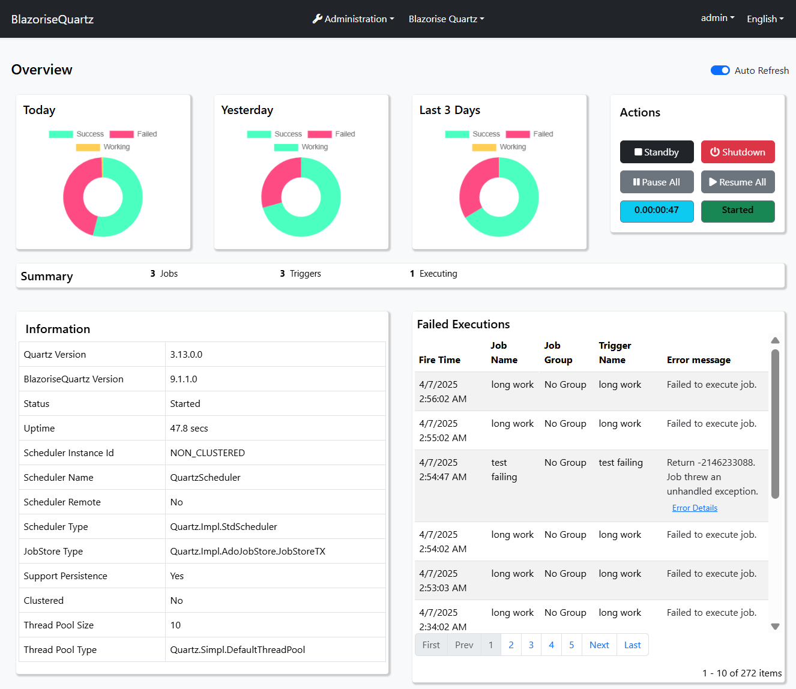
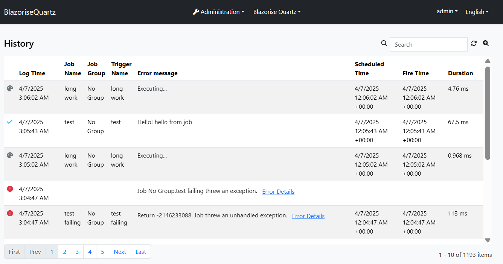
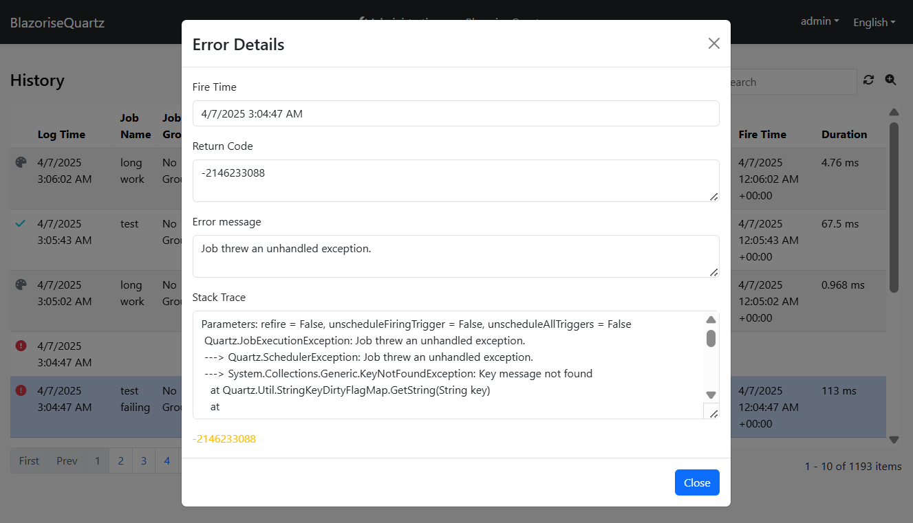
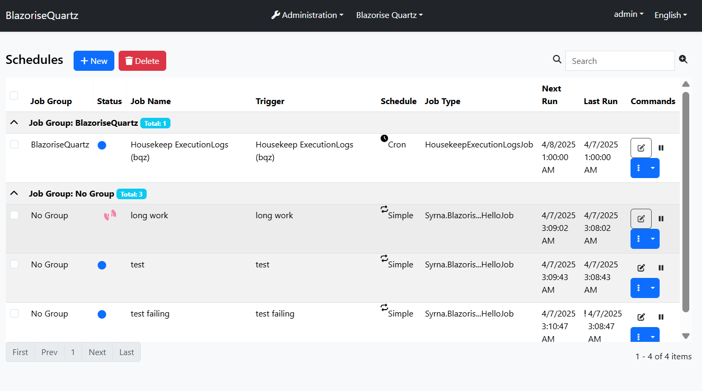
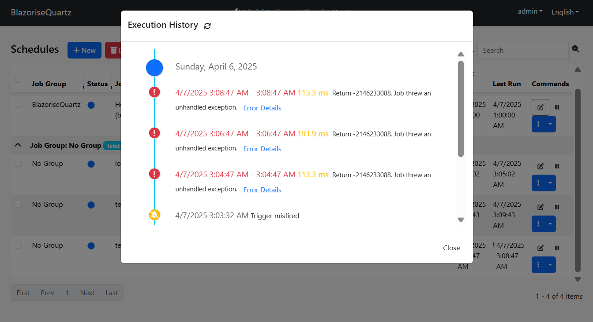
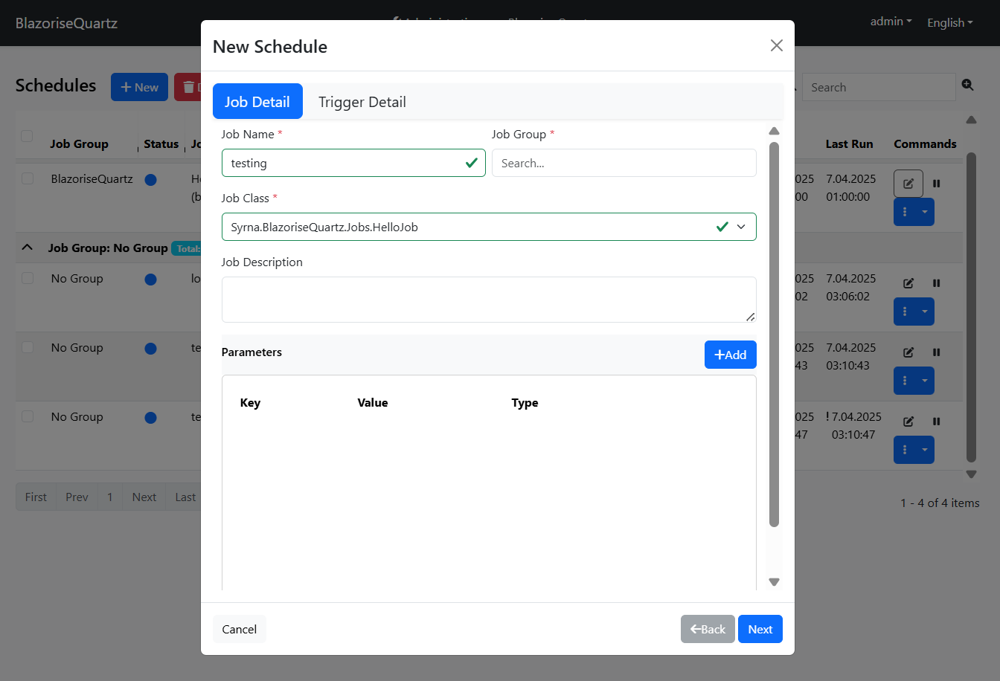
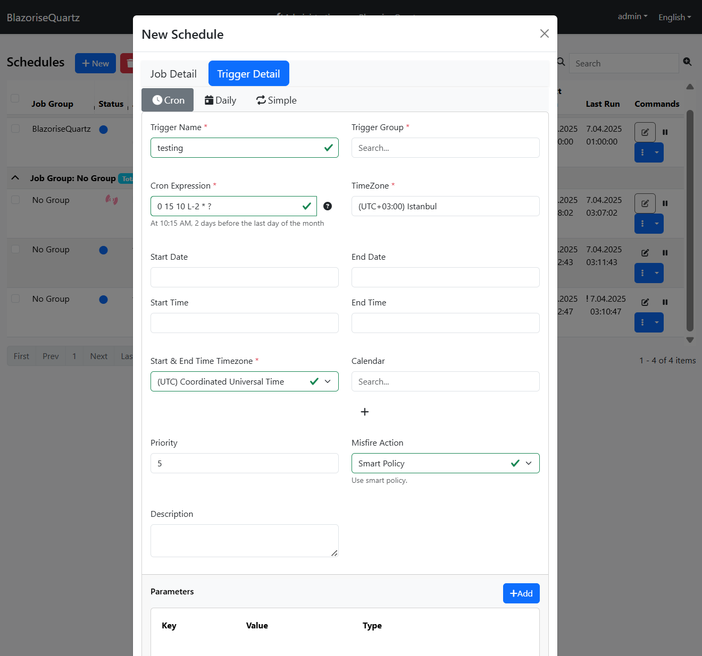
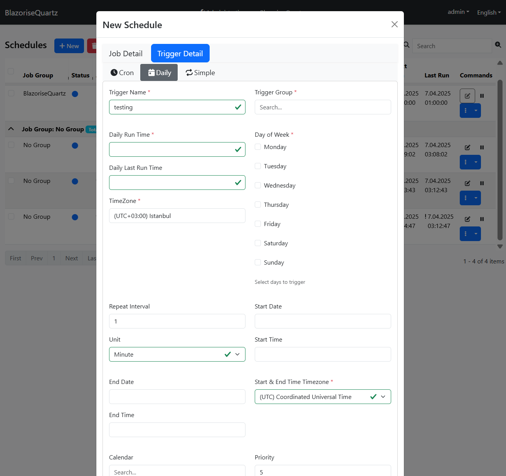
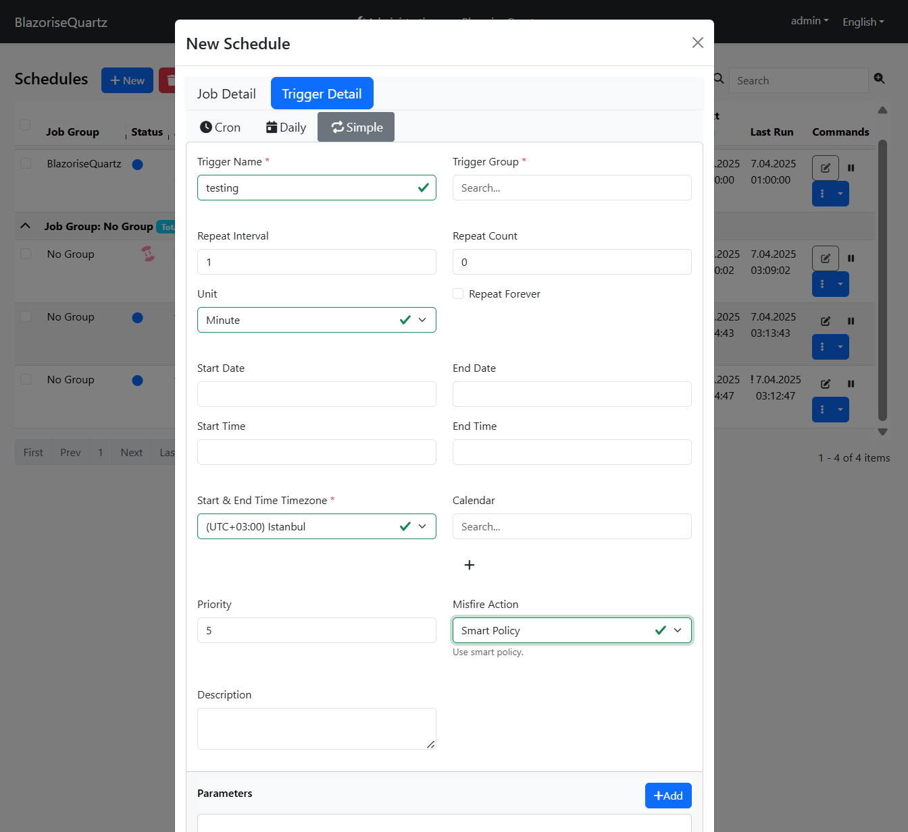

# Syrna.BlazoriseQuartz
Quartz scheduling module for ABP framework.

[](https://abp.io)

[](https://www.nuget.org/packages/Syrna.BlazoriseQuartz.Application)
[](https://www.nuget.org/packages/Syrna.BlazoriseQuartz.Application) 

An abp application module that allows manage quartz scheduling.

## Installation

1. Install the following NuGet packages. ([see how](https://github.com/SyrnaAbp/SyrnaAbpGuide/blob/master/docs/How-To.md#add-nuget-packages))

    * Syrna.BlazoriseQuartz.Application
    * Syrna.BlazoriseQuartz.Application.Contracts
    * Syrna.BlazoriseQuartz.Domain
    * Syrna.BlazoriseQuartz.Domain.Shared
    * Syrna.BlazoriseQuartz.EntityFrameworkCore
    * Syrna.BlazoriseQuartz.HttpApi
    * Syrna.BlazoriseQuartz.HttpApi.Client
    * Syrna.BlazoriseQuartz.Web
    * Syrna.BlazoriseQuartz.Blazor
    * Syrna.BlazoriseQuartz.Blazor.Server
    * Syrna.BlazoriseQuartz.Blazor.WebAssembly

1. Add `DependsOn(typeof(BlazoriseQuartzXxxModule))` attribute to configure the module dependencies. ([see how](https://github.com/SyrnaAbp/SyrnaAbpGuide/blob/master/docs/How-To.md#add-module-dependencies))

1. Add `builder.ConfigureBlazoriseQuartz();` to the `OnModelCreating()` method in **MyProjectMigrationsDbContext.cs**.

1. Add EF Core migrations and update your database. See: [ABP document](https://docs.abp.io/en/abp/latest/Tutorials/Part-1?UI=MVC&DB=EF#add-database-migration).

## Requirements
* .NET 9
* ABP 9.1.1
* Quartz 3.13.0+

## Features
* Add, modify jobs and triggers
* Support Cron, Daily, Simple trigger
* Pause, resume, clone scheduled jobs
* Create custom UI to configure job
* Dynamic variables support
* Monitor currently executing jobs
* Load custom job DLLs through configuration
* Display job execution logs, state, return message and error message
* Filter execution logs
* Store execution logs into any database
  * Build-in support for SQLite, MSSQL and PostgreSQL
* Auto cleanup of old execution logs
  * Configurable logs retention days
* Build-in Jobs
  * HTTP API client job


## Usage
> 1. You must create quartz database. You can find sql mssql script https://github.com/SyrnaAbp/Syrna.BlazoriseQuartz/blob/dev/demos/MainDemo/src/Syrna.BlazoriseQuartz.MainDemo.DbMigrator/sqlserver.sql 
> 2. If you will change database, get your sql script from https://github.com/quartznet/quartznet/tree/main/database/tables
> 3. modify your appsettings.json
> 4. More details can be found at [BlazoriseQuartz](https://github.com/Dolunay/BlazoriseQuartz)

PostgreSql
   ```
   "ConnectionStrings": {
     "Default": "Host=<db_host>;Port=5432;Database=<db_name>;Username=<db_user>;Password=<db_password>"
   },
   "Quartz": {
     ...
     "quartz.jobStore.driverDelegateType": "Quartz.Impl.AdoJobStore.PostgreSQLDelegate, Quartz",
     ...
     "quartz.dataSource.myDS.provider": "Npgsql"
   },
   "BlazoriseQuartz": {
     "DataStoreProvider": "PostgreSQL",
   ```
   MsSql
   ```
   "ConnectionStrings": {
    "Default": "Server=(LocalDb)\\MSSQLLocalDB;Database=SyrnaBlazoriseQuartz;Trusted_Connection=True"
   },
   "Quartz": {
     ...
    "quartz.jobStore.driverDelegateType": "Quartz.Impl.AdoJobStore.StdAdoDelegate, Quartz",
     ...
     "quartz.dataSource.myDS.provider": "SqlServer"
   },
   "BlazoriseQuartz": {
     "DataStoreProvider": "SqlServer",
   ```











## Reference

### This project based on [BlazoriseQuartz](https://github.com/Dolunay/BlazoriseQuartz)

### Differences

1. Demo project created for OpenIddict
2. Demo project extended modules added
3. Blazor modules added
4. Abp Localization system integrated
5. Turkish localization
6. English localization

